## L'explosion ChatGPT en chiffres (Juillet 2025) [@chatterjiHowPeopleUse] {style="font-size:0.7em"}

Pour comprendre pourquoi ce cours est essentiel, il faut saisir deux
choses : l'échelle du phénomène et la mutation de ses usages.

::::: columns
::: {.column width="50%"}
### L'échelle : un phénomène de masse

-   **700 millions** d'utilisateurs actifs par semaine.
-   **18 milliards** de messages échangés chaque semaine.
-   **x5.8** : Croissance du volume de messages en un an (Juin
    2024-2025).
-   **Cible jeune** : **46%** des messages proviennent des **18-25
    ans**.
:::

::: {.column width="50%"}
### La tendance de fond : de la création à la recherche

En un an, les usages ont basculé :

-   **L'écriture** (créer, résumer) a vu sa part baisser de 36% à
    **24%**.
-   **La recherche d'infos** a explosé, passant de 14% à **24%**.

**Les trois usages majoritaires (près de 80% du total) sont :**

\

1.  **Guide pratique** (29%)
2.  **Recherche d'infos** (24%)
3.  **Écriture** (24%)
:::
:::::

::: {.callout-tip title="L'implication pour ce cours"}
En moins de deux ans, ChatGPT est passé d'un outil de "création de
contenu" à un **concurrent direct de Google pour la recherche
d'information**, en particulier chez les jeunes.
:::

## Contexte après les deux premières séances {style="font-size:0.9em"}

### Vos acquis :

\

1.  **Évaluation de l'information** : vous savez distinguer une source
    scientifique d'une source qui l'est moins et en évaluer la
    crédibilité.

\

2.  **Compréhension de la production scientifique** : vous comprenez la
    structure d'un article, la question de recherche, les hypothèses,
    les résultats, les différents journaux...

\

3.  **Maîtrise des outils traditionnels** : vous pouvez utiliser les
    bases de données académiques comme Scopus ou la recherche Google
    Scholar.

## Un petit sondage à main levée... {style="font-size:0.8em"}

Qui a déjà entendu parler de...

::::::: columns
:::: {.column width="50%"}
### Applications / produits

::: incremental
-   
    **ChatGPT** ?
-   
    **Mistral** ?
-   
    **Claude** ?
-   
    **Gemini** ?
-   
    **DeepSeek** ?
-   
    **Qwen** ?
:::
::::

:::: {.column .fragment width="50%"}
### Concepts

::: incremental
-   LLMs ? (Large Language Models)
-   Tokens ?
-   Embeddings ?
-   RAG (Retrieval-Augmented Generation) ?
-   Fine-tuning ?
-   Context window ?
-   Attention / Transformers ?
-   Few-shot / Zero-shot ?
-   Chain-of-thought ?
:::
::::
:::::::

:::: fragment
::: {.callout-note title="Notre objectif aujourd'hui" style="font-size:0.8em"}
-   Passer de la simple connaissance des **produits**…
-   … à la compréhension des **concepts**.
-   Pour les utiliser de manière **critique** et **efficace**.
:::
::::

## Pour commencer : de quoi parle-t-on ? {style="font-size:0.65em"}

::::::: columns
:::: {.column width="50%"}
::: incremental
1.  **Intelligence Artificielle (IA)** : Le grand domaine qui vise à
    reproduire des comportements "intelligents".

2.  **Machine Learning (ML)** : Une branche de l'IA où la machine
    **apprend par l'exemple**. [@jordan2015]

3.  **Réseaux de Neurones** : La technique de ML inspirée du cerveau,
    qui est la base du Deep Learning. L'apprentissage repose sur des
    connexions pondérées entre neurones artificiels. [@rumelhart1986]

4.  **Deep Learning (DL)** : Utilise des réseaux de neurones
    **profonds** (avec de nombreuses couches) [@lecun2015].

5.  **IA Générative** : La branche du DL qui se spécialise dans la
    **création de nouveau contenu** (texte, images...) [@goodfellow2014]

6.  **LLMs** : Type particulier de modèle de deep learning entraîné sur
    d’immenses corpus textuels [@brown2020]
:::
::::

::: {.column width="50%"}
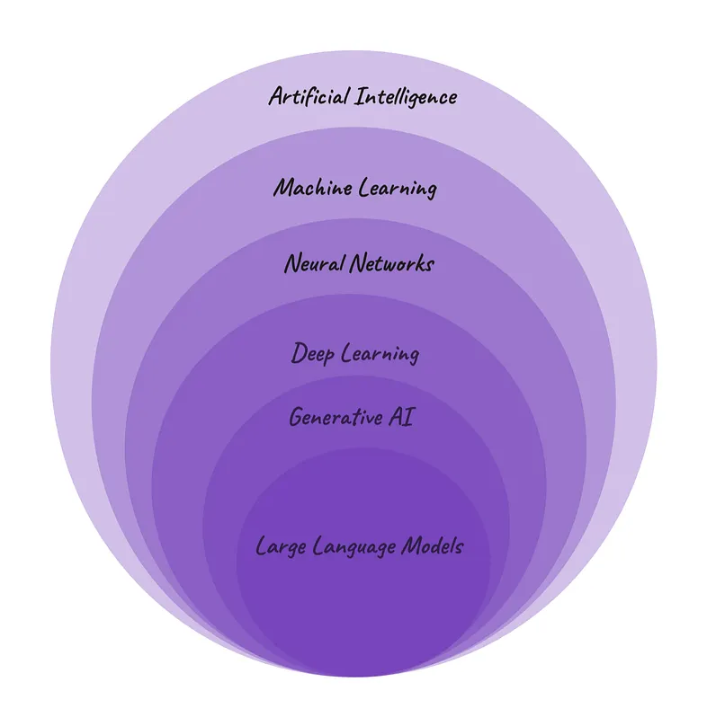{fig-align="right" width="75%"}
:::

::: fragment
Ajuster le modèle pour qu'il **colle aux données** (réduire l'erreur),
sans "apprendre par cœur" (éviter le **sur-apprentissage**).
:::
:::::::

::: footer
Illustration de Caprasi, C. (2023). *Artificial Intelligence, Machine
Learning, Deep Learning, GenAI and more.* *Women in Technology -
Medium.* <https://medium.com/womenintechnology/ai-c3412c5aa0ac>
:::

# Comprendre comment fonctionnent les LLMs {background-color="#4285F4"}

------------------------------------------------------------------------

## La limite du "sac de mots" (Bag-of-Words) {style="font-size:0.9em"}

::::: columns
::: {.column width="40%"}
L'approche **Bag-of-Words** se contente de compter les mots, mais ignore
leur sens et leur ordre.

-   **Le problème** : le modèle ne comprend pas que des mots sont
    sémantiquement proches.

-   **Exemple** : pour lui, "**roi**" est aussi éloigné de "**reine**"
    que de "**camion**".

-   **Le défi** : Comment la machine peut-elle apprendre que
    "**excellent**" est proche de "**superbe**" ?
:::

::: {.column width="60%"}
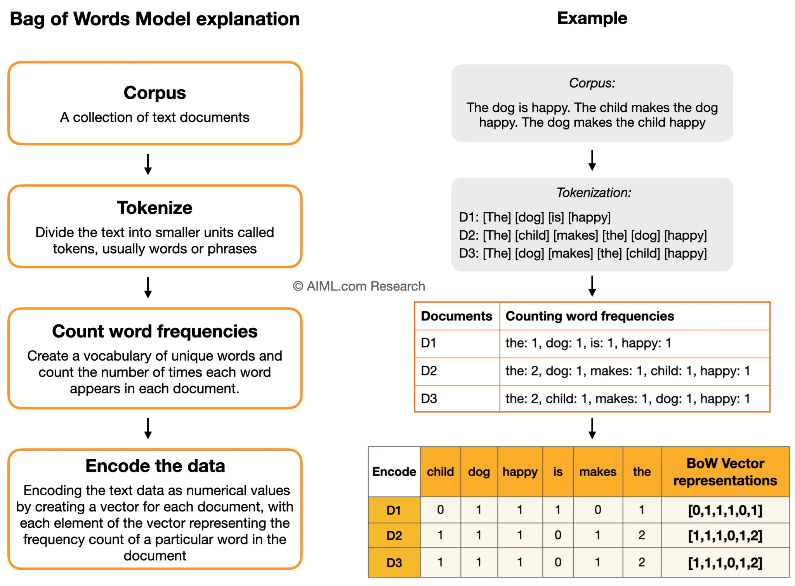
:::
:::::

------------------------------------------------------------------------

## L’idée de l’embedding : représenter des concepts par des nombres {style="font-size:0.6em"}

Avant de voir comment une machine comprend les *mots*, imaginons comment
représenter une *personne* en chiffres. C’est le principe de
l’**embedding** (ou "plongement").

:::::: columns
::: {.column width="33%" .fragment}

### **1. Une seule dimension**

Un test peut donner un score unique, par exemple sur l’axe
introversion/extraversion. Ce score devient la première coordonnée du
"vecteur de personnalité".

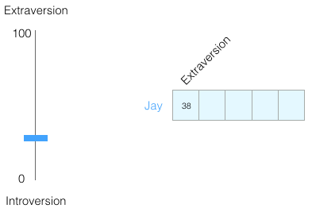{fig-alt="Un seul trait de personnalité représenté sur un axe et comme un vecteur à une dimension."}
:::

::: {.column width="33%" .fragment}
### **2. Ajouter de la complexité**

On change d'échelle : on normalise les valeurs pour s'intéresser
uniquement à la direction du vecteur (qui porte le sens), pas à sa
longueur.

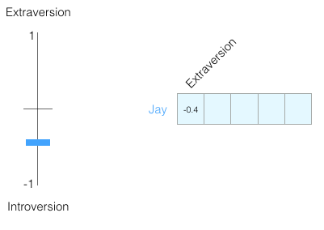
:::

::: {.column width="33%" .fragment}
### **3. Vers N dimensions**

Les tests comme le *Big Five* utilisent au moins 5 dimensions. En
machine learning, on peut en avoir des milliers. La personnalité devient
un **vecteur de nombres**, chaque valeur représentant un score.

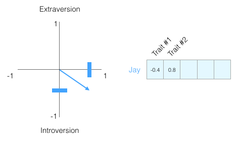{fig-alt="Résultats d'un test de personnalité Big Five avec cinq scores."}
:::
::::::

::: {.callout-tip title="L'idée fondamentale de l'embedding" .fragment}
Un concept complexe (une personne, un mots, des phrases) peut être
représenté par un **vecteur numérique**.

**Avantage** : les machines peuvent **mesurer les similarités** en
comparant ces vecteurs.
:::

::: footer
Source des illustrations Word2Vec: Alammar, J. (2019). *The Illustrated
Word2Vec*. <https://jalammar.github.io/illustrated-word2vec/>
:::

------------------------------------------------------------------------

## Comment la machine "compare" les personnalités ? {style="font-size:0.6em"}

Maintenant que chaque personne est un vecteur de nombres, on peut
utiliser un outil mathématique simple pour calculer à quel point elles
sont "proches" en termes de personnalité : la **similarité cosinus**.

::::: columns
::: {.column width="50%" .fragment}
### 1. **L'intuition : l'angle** 📐

L'idée n'est pas de mesurer la distance entre les points, mais plutôt
l'**angle** entre les flèches (vecteurs).

-   **Angle faible** (directions similaires) ➞ **Score de similarité
    élevé**.
-   **Angle grand** (directions opposées) ➞ **Score de similarité
    faible/négatif**.

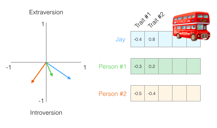{fig-alt="Vecteurs de personnalité dans un espace à 2 dimensions."}
:::

::: {.column width="50%" .fragment}
### 2. **Le calcul en action**

La fonction `cosine_similarity` nous donne un score entre -1 (opposés)
et 1 (identiques).

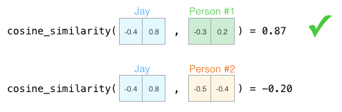 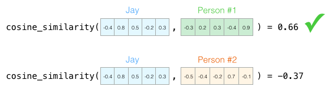

On voit que **Jay** est bien plus **similaire** à la **Personne #1**
qu'à la **Personne #2**, que ce soit avec 2 ou 5 dimensions !
:::
:::::

::: {.callout-note appearance="simple" .fragment}
### L'avantage clé

Peu importe le nombre de dimensions (2, 5, plusieurs centaines ou
milliers pour les modèles de langue !), la **similarité cosinus** nous
donne un **score unique et fiable** pour quantifier la ressemblance
entre deux concepts. C’est la base de nombreuses applications : moteurs
de recommandation, recherche sémantique… et bien plus encore.
:::

------------------------------------------------------------------------

## La révolution Word2Vec : le sens par le contexte {style="font-size:0.65em"}

> *"You shall know a word by the company it keeps"* [@firth1957]

Un mot prend son sens des mots qui l’entourent
[@harris1954distributional].\
Cette idée inspire les modèles d’**embeddings**, où chaque mot est
représenté par un vecteur numérique.

-   @bengio2003neural ont proposé le premier
    modèle neuronal apprenant ces représentations de mots.\
-   @mikolov2013 ont simplifié cette
    approche avec **Word2Vec**, rendant l’apprentissage des vecteurs
    rapide et efficace.

Le résultat : les mots apparaissant dans des contextes similaires
finissent par avoir des vecteurs proches dans l’espace sémantique.

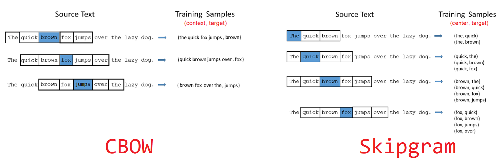{fig-alt="Illustration CBOW vs Skip-gram"
fig-align="center" width="80%"}

::: notes
Même si leurs idées sont proches, Harris et Firth ne disent pas la même
chose. En résumé :

-   **Harris** a fourni la **méthode technique** : son hypothèse
    distributionnelle est une technique formelle basée sur les
    statistiques de cooccurrence des mots.

-   **Firth** a fourni le **cadre philosophique** : sa théorie
    contextuelle du sens est plus large, considérant le sens comme
    l'usage d'un mot dans une situation sociale.

On les cite souvent ensemble car Harris justifie la méthode statistique
de Word2Vec, tandis que Firth donne l'intuition fondamentale que le
contexte est la clé du sens.
:::

------------------------------------------------------------------------

## Visualiser un embedding 1/3 {style="font-size:0.8em"}

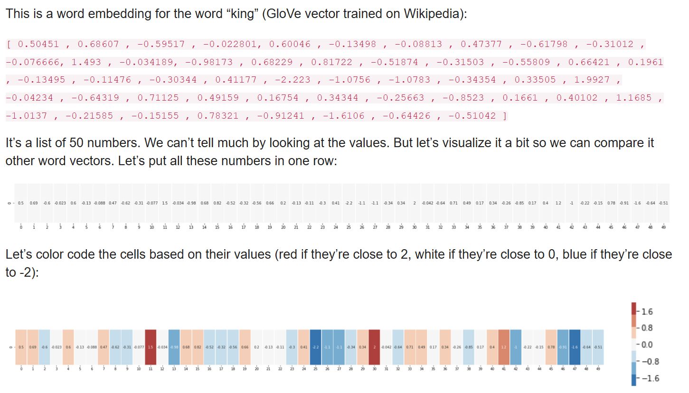

## Visualiser un embedding 2/3 {style="font-size:0.8em"}

Chaque mot est représenté par un **vecteur de nombres** (par ex. 50 ou
300 dimensions). Pris séparément, ces valeurs n’ont pas de sens pour
nous. Mais en comparant plusieurs mots, on voit apparaître des **motifs
de similarité**.

::::: columns
::: {.column width="40%"}
-   *man* et *woman* → vecteurs proches.
-   *king* et *queen* → partagent des dimensions → idée de **royauté**.
-   *boy* et *girl* → proches sur d’autres dimensions → idée de
    **jeunesse**.
-   *water* → se distingue nettement des mots “personnes”.

💡 Les embeddings capturent des **régularités invisibles**, uniquement à
partir des contextes.
:::

::: {.column width="60%"}
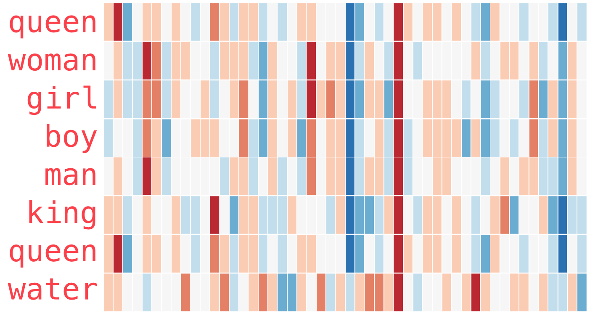
:::
:::::

## Visualiser un embedding 3/3 {style="font-size:0.8em"}

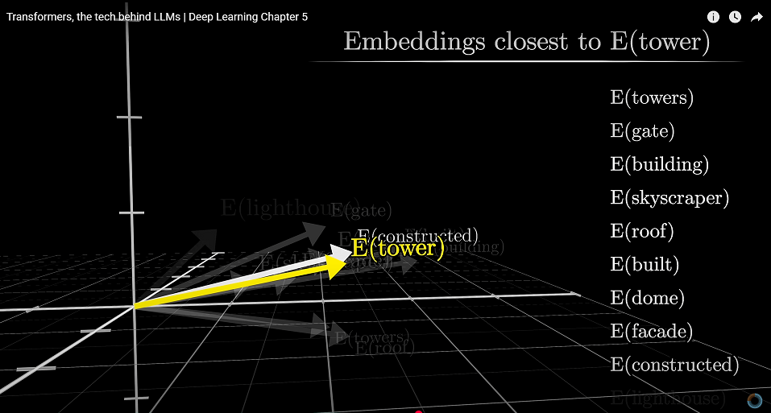{fig-align="center"}

::: footer
Source : *Transformers, the tech behind LLMs* - *Deep Learning, Chapter
5.*\
[Vidéo Youtube](https://www.youtube.com/watch?v=wjZofJX0v4M)
:::

## Analogies vectorielles {style="font-size:0.6em"}

Les vecteurs de mots se combinent algébriquement. Ce n’est pas magique :
la **géométrie des vecteurs** encode des relations sémantiques et
syntaxiques.

::::: columns
::: {.column width="40%"}
-   *V(roi) - V(homme) + V(femme) ≈ V(reine)*
-   *V(Paris) - V(France) + V(Italie) ≈ V(Rome)*

Avec des bibliothèques comme **Gensim en python** ou **word2vec en
R**, on peut réellement calculer ces analogies et retrouver les mots les
plus proches.
:::

::: {.column width="60%"}
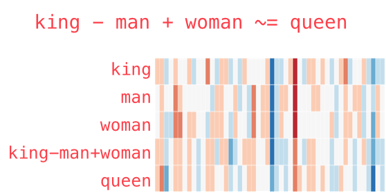
:::
:::::

### Applications concrètes possibles pour une revue de littérature

::: incremental
-   Formuler sa recherche comme une **vraie question**, pas juste une
    liste de mots-clés.

-   "Scanner" 100 abstracts en 1 minute pour en extraire les
    **méthodologies et conclusions**.

-   Se faire recommander des articles sémantiquement proches d'articles
    identifiés comme **fondateurs**.

-   Et surtout comprendre la **logique interne** de la plupart outils IA
    utilisés ensuite.
:::

## Applications Embeddings (SLR + Master Dauphine) {style="font-size:1em"}

Démo `images_interactives`

## Le mécanisme d'attention [@vaswani2017attention] {style="font-size:0.70em"}

::::: columns
::: {.column width="60%"}
L'idée fondamentale des Transformers est simple : pour comprendre un
mot, le modèle doit **porter son attention** sur les autres mots
importants de la phrase.

Imaginez que pour chaque mot, on fasse un éclairage 🔦 sur les autres
termes qui lui donnent son sens.

\
\

**Exemple :**

> `"Le livreur a déposé le colis devant la porte, car il était trop lourd."`

\

Pour comprendre le mot **"il"**, le modèle va apprendre à porter son
attention sur :

-   **"colis"** (très forte attention : c'est l'antécédent le plus
    probable !)
-   **"livreur"** (un peu d'attention : c'est un autre acteur, mais
    moins pertinent pour "il")
-   **"lourd"** (attention moyenne : c'est une caractéristique qui
    justifie le "il")
:::

::: {.column width="40%"}
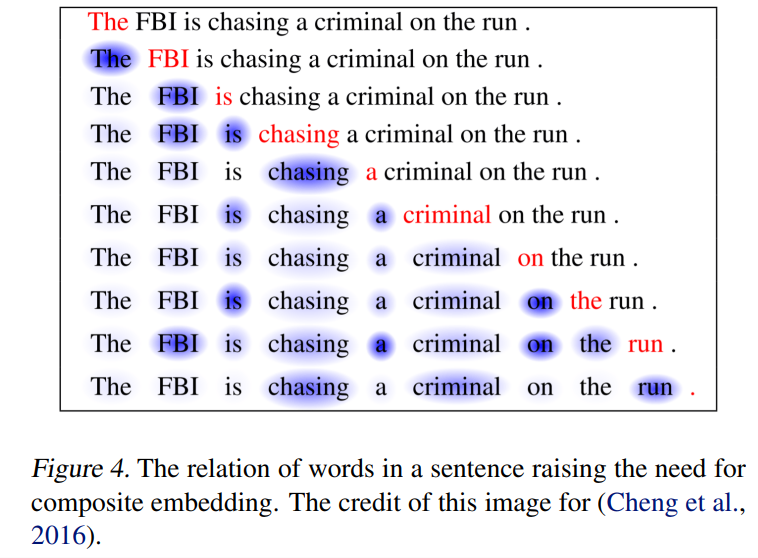{width="100%"}\
:::
:::::

::: {.callout-tip title="La grande différence"}
Contrairement à Word2Vec qui regarde une petite fenêtre fixe,
l'**attention** permet de créer des liens sémantiques entre des mots
**même très éloignés** dans la phrase. Le modèle apprend quelles parties
du contexte sont les plus pertinentes.
:::

## Pour aller plus loin : les Transformers ([3Blue1Brown (Grant Sanderson)](https://www.youtube.com/c/3blue1brown)) {style="font-size:0.7em"}

Ces deux vidéos sont fortement recommandées pour une compréhension
visuelle et approfondie des concepts clés des Transformers.

::::: columns
::: {.column width="50%"}
### L'architecture "Transformers"

Cette vidéo offre une vue d'ensemble de l'architecture Transformer, le
moteur des grands modèles de langage modernes.

\
\


:::

::: {.column width="50%"}
### Le mécanisme d'Attention

Cette seconde vidéo se concentre sur le concept crucial de l'attention,
permettant au modèle de "comprendre" le contexte.

\
\


:::
:::::

## Comment un LLM apprend-il ? Le jeu du mot suivant {style="font-size:0.7em"}

L'entraînement d'un LLM comme GPT-4 repose sur un principe simple,
répété des milliards de fois sur un corpus gigantesque.

**La tâche : prédire le token le plus probable.**

1.  On lui donne un début de phrase (un "prompt") :

    `"Le client a contacté le service après-vente car son produit était..."`

2.  Le modèle calcule une distribution de probabilité sur l'ensemble de
    son vocabulaire pour le mot suivant.

    -   `défectueux` : 15% de probabilité
    -   `cassé` : 12% de probabilité
    -   `livré` : 5% de probabilité
    -   `incroyable`: 0.1% de probabilité
    -   `manger` : 0.0001% de probabilité
    -   `...`

::: {.callout-tip title="De la prédiction à l'émergence des capacités"}
En répétant ce "jeu" des milliards de fois, le modèle apprend les
régularités du langage : grammaire, faits, styles d’écriture, voire
certaines capacités de raisonnement **émergentes** [@wei2022emergent].\
Ce type d’apprentissage, fondé sur la prédiction à partir de texte brut,
est appelé **auto-supervision** (*self-supervised learning*).
:::

## Visualisation de GPT-3 ([3Blue1Brown (Grant Sanderson)](https://www.youtube.com/c/3blue1brown)) {style="font-size:0.7em"}

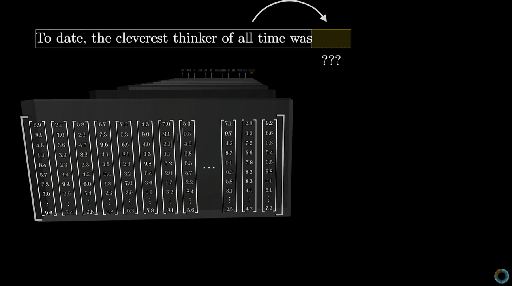{fig-align="center" width="90%"}

------------------------------------------------------------------------

## Quel LLM choisir ? Quelques concepts clés {style="font-size:0.6em"}

::::: columns
::: {.column width="50%"}
### Pourquoi ces concepts sont cruciaux ?

-   Ils expliquent **pourquoi** certains outils excellent dans certaines
    tâches
-   Ils vous aident à **choisir le bon outil** pour votre besoin
-   Ils vous permettent d'**anticiper les limites** avant de les
    rencontrer
-   Ils constituent le vocabulaire de base pour comprendre les
    nouveautés à venir
:::

::: {.column width="50%" .fragment}
### Quelques concepts clés

1.  **Fenêtre de contexte** : La mémoire de travail de l'IA
2.  **RAG** : l'IA accède à des informations externes
3.  **Fine-tuning** : comment spécialiser/adapter un modèle
4.  **Agents** : l'IA qui agit de manière autonome en utilisant des
    outils
:::
:::::

::: {.callout-note title="Comment évaluer les performances des LLMs ?" .fragment}
Il existe une **multiplicité de benchmarks**, chacun ciblant des
compétences différentes (connaissances, raisonnement, recherche d’info,
agenticité, etc.).\
Exemples représentatifs et **vérifiés** :

-   **MMLU** - 57 matières académiques, QCM de culture générale et
    spécialisée [@hendrycks2021mmlu].\
-   **GPQA** - Questions de niveau doctorat en physique/chimie/biologie,
    « Google-proof » [@rein2023gpqa].\
-   **GAIA** - Benchmark d’**agents** pour questions “réelles”
    nécessitant outils, web et multimodalité [@mialon2023gaia].\
-   **MathArena** - Plateforme/leaderboard évaluant le **raisonnement
    mathématique** sur concours/récents (IMO, etc.)
    [@balunovic2025matharena].\
-   **BEIR** - Évaluation **IR** (recherche d’info) hétérogène, 18
    datasets, zéro-shot [@thakur2021beir].\
-   **LoTTE** - Évaluation IR sur **sujets long-tail** (StackExchange),
    complément de BEIR [@santhanam2021lotte].

💡 Interprétez toujours les scores **par rapport à la tâche ciblée** :
un bon score MMLU ne garantit pas de bonnes performances en **recherche
d’articles** (IR/RAG), et inversement.
:::

## Le problème des benchmarks des LLM et des agents {style="font-size:0.7em"}

> *“Today’s benchmarks measure what is easy to measure, not what
> matters.”*\
> [@kapoorAIAgentsThat2024]

-   Les benchmarks actuels donnent souvent une **image trop flatteuse**
    des performances des agents IA.\
-   Ils ne mesurent pas toujours les éléments essentiels comme :
    -   le **coût réel** (temps, tokens),
    -   la **robustesse** face à des variations imprévues,
    -   la **reproductibilité** des résultats.
-   Ce qui brille dans un leaderboard n’est pas forcément ce qui
    **fonctionne dans la vraie vie**.

\
\
\

Une vidéo intéressante sur ce sujet ⬇️

::: footer
« En fait, les LLMs ne stagnent pas du tout » - *Vidéo de Micode avec
Grégoire Mialon et Clémentine Fourrier*.\
<https://www.youtube.com/watch?v=biZX5cnQ_UU>
:::

------------------------------------------------------------------------

## 1. La fenêtre de contexte : la mémoire limitée des LLMs {style="font-size:0.7em"}

> *"Language models struggle to use information located in the middle of
> long contexts, a phenomenon known as 'lost in the middle'."*
> [@liuLostMiddle2023]

La **fenêtre de contexte** correspond à la quantité maximale de texte
qu’un LLM peut traiter en une seule fois\
(prompt + réponse), mesurée en **tokens**. Les capacités des LLMs
évoluent très vite.

::::: columns
::: {.column width="50%"}
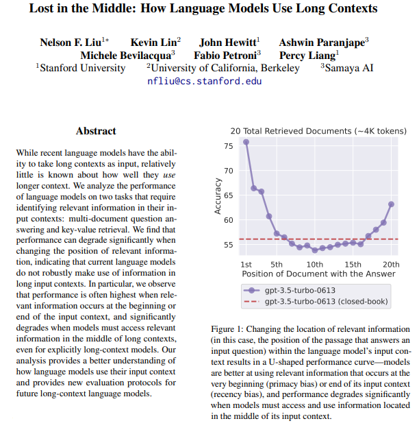{fig-align="center" width="70%"}
:::

::: {.column width="50%"}
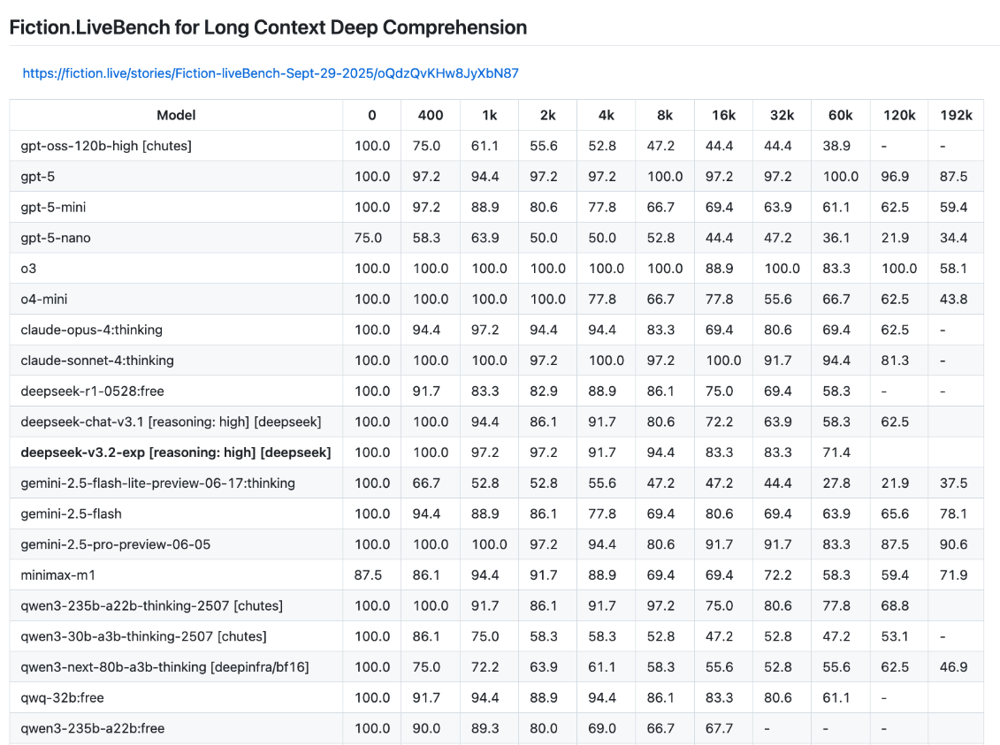{fig-align="center"
width="100%"}
:::
:::::

## 2. RAG {style="font-size:0.7em"}

Le **Retrieval-Augmented Generation** combine recherche et génération.

1.  Le LLM **cherche** d'abord des informations dans une base externe
    (web, PDFs, articles...).
2.  Il **injecte** ces informations dans son contexte.
3.  Il **génère** une réponse basée sur ces sources.

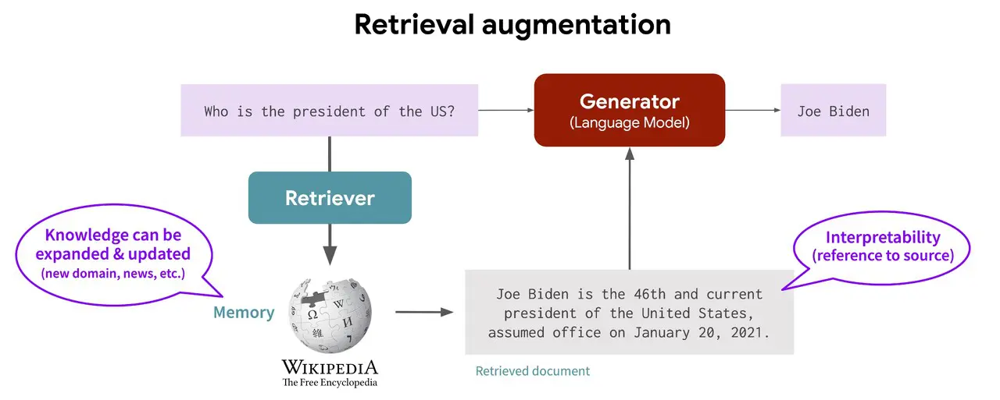{fig-align="center" width="80%"}

::: footer
Illustration d’**Akriti Upadhyay** - *Efficient Information Retrieval
with RAG Workflow* (Medium, 2023).\
[https://medium.com/\@akriti.upadhyay/efficient-information-retrieval-with-rag-workflow-afdfc2619171](https://medium.com/@akriti.upadhyay/efficient-information-retrieval-with-rag-workflow-afdfc2619171){.uri}
:::

## 3. Transfer learning et fine-tuning {style="font-size:0.68em;"}

::::: columns
::: {.column width="50%"}
> *« Technique consistant à spécialiser un modèle d’IA pré-entraîné à
> l’accomplissement d’une tâche spécifique. »*
> ([CNIL](https://www.cnil.fr/fr/definition/ajustement-fine-tuning))

-   **Transfer learning** = concept général : réutiliser un modèle
    pré-entraîné pour une tâche ou un domaine cible.
-   **Fine-tuning** = méthode concrète de transfer learning :
    ré-entraîner (partiellement ou totalement) les poids du modèle sur
    des données spécifiques.

### Exemples illustratifs

-   **SciBERT** : Modèle BERT [@devlin2019bert] pré-entraîné et affiné
    sur des articles scientifiques pour mieux traiter le texte
    biomédical [@beltagy2019scibert].

-   **SiEBERT** : Modèle généraliste affiné sur **272 jeux de données** en anglais pour créer un
    classificateur robuste (analyse de sentiment) [@hartmannMoreFeelingAccuracy2023a].
:::

::: {.column width="50%"}
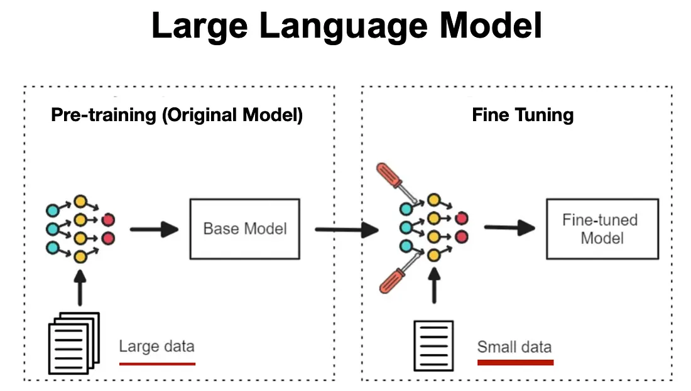{fig-align="right" width="80%"}\
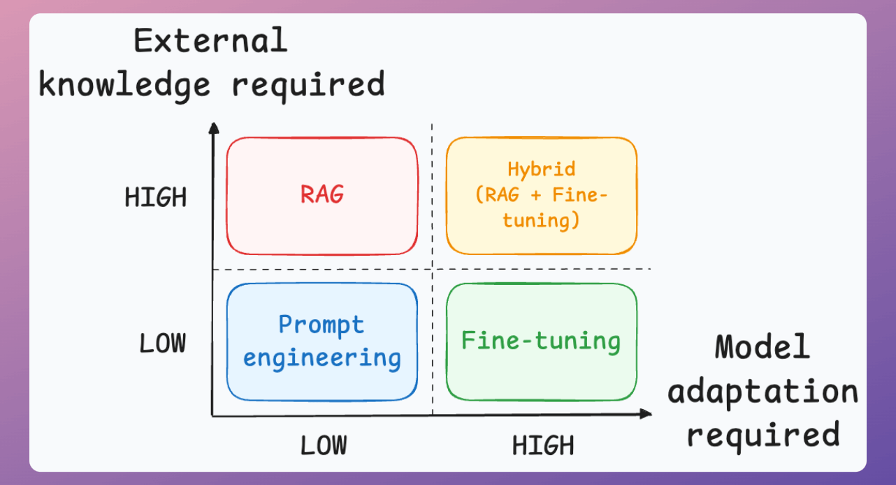{fig-align="right" width="80%"}
:::
:::::

## 4. Les Agents : l'IA qui agit de manière autonome {style="font-size:0.6em"}

> *“An autonomous agent is a system situated within and a part of an
> environment that senses that environment and acts on it, over time, in
> pursuit of its own agenda and so as to effect what it senses in the
> future.”* - [@franklinItAgentJust1997]

-   Un **agent IA** combine **raisonnement**, **action** et
    **interaction avec un environnement**.\
-   Les **LLM agents** représentent une évolution : ils planifient,
    mémorisent, utilisent des outils, collaborent et s’adaptent.
-   Ils constituent une brique centrale pour l’automatisation avancée de
    tâches, y compris pour la revue de littérature ou la recherche
    scientifique.

:::::: columns
:::: {.column width="50%"}
### De l’émergence à la structuration des agents LLM

-   **2022** : apparition des premiers agents combinant raisonnement et
    action [@yao2023react].
-   **2023** : diffusion grand public avec les premières implémentations
    autonomes, notamment via [AutoGPT](https://github.com/Significant-Gravitas/AutoGPT).
-   **2024–2025** : agents dotés de mémoire, coordination et rôles
    spécialisés [@wang2024survey; @luo2025largelanguage].

::: callout-note
#### Pour aller plus loin

-   Une liste actualisée des travaux est disponible ici : [Awesome Agent
    Papers](https://github.com/luo-junyu/Awesome-Agent-Papers).
:::
::::

::: {.column width="50%"}
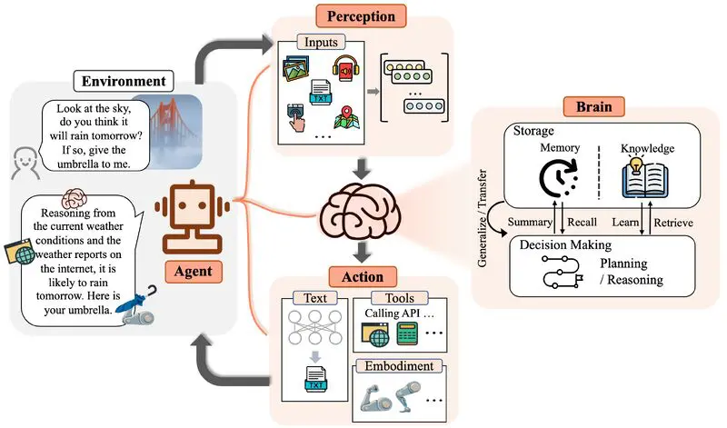{width="100%"}
:::
::::::

::: footer
Illustration de *Data Science Dojo* - “LLM Agents to Empower Language
Models”.\
<https://datasciencedojo.com/blog/llm-agents-to-empower-language-models/>
:::

## Le coût des LLMs {style="font-size:0.6em"}

### Modèles et abonnements en octobre 2025

| Service | Prix public | Ce que ça débloque / note | Lien |
|-----------------|--------------------:|-----------------|-----------------|
| **ChatGPT Free** | **0 €** | Accès de base | [Site](https://openai.com/chatgpt/pricing) |
| **ChatGPT Plus** | **\~20 \$/mois** *(facturé en devise locale, TVA selon pays)* | Accès élargi aux modèles (GPT-4/o1), fonctionnalités avancées | [Site](https://openai.com/chatgpt/pricing) |
| **Claude Pro** | **17 \$/mois (annuel)** ou **20 \$/mois** *(HT)* | Plus d’usage, modèles Claude 3.x/4.x, fonctionnalités pro | [Site](https://www.claude.com/pricing) |
| **Perplexity Pro** | **20 $/mois** | Accès à des modèles avancés (OpenAI, Anthropic, etc.), recherche approfondie, limites Pro accrues (300+ recherches/jour), gestion de fichiers & collections | [Site](https://www.perplexity.ai/enterprise/pricing) |
| **Google AI Pro (Gemini)** | **21,99 €/mois** | Gemini 2.5 Pro, NotebookLM, 2 To, Deep Research | [Site](https://one.google.com/about/google-ai-plans/) |
| **Mistral – Le Chat Pro** | **17,99 €/mois** *(7,19 € pour étudiants, 12 mois)* | Version Pro de “Le Chat” | [Site](https://mistral.ai/pricing) |
| **Elicit Plus** | **10 \$/mois (annuel)** ou **12 \$/mois** | Extraction/synthèse, export de données | [Site](https://elicit.com/pricing) |
| **Elicit Pro** | **à partir de 42 \$/mois (annuel)** | Workflows RL/SLR, quotas plus importants | [Site](https://elicit.com/pricing) |
| **DeepSeek (API)** | **0,028 \$/M tokens (cache hit)** - **0,28 \$/M (miss)** - **0,42 \$/M output** |  | [Site](https://api-docs.deepseek.com/quick_start/pricing) |

## L’art du Prompt Engineering - exemple pour revue de littérature {style="font-size:0.8em"}

::: incremental
-   **Donner un rôle clair** → aide l’IA à adopter une “posture
    experte”\
    *Montré comme une bonne pratique dans plusieurs études de synthèse*
    [@vatsal2024survey; @sahoo2025systematic]

-   **Montrer un exemple** (*few-shot prompting*) → augmente fortement
    la qualité et la cohérence des réponses\
    *Effet mesuré dans des benchmarks sur des tâches complexes*
    [@vatsal2024survey]

-   **Demander un raisonnement étape par étape** (*chain-of-thought*) →
    réduit les erreurs factuelles et améliore la profondeur\
    *Résultats solides dans les grandes revues sur le prompt
    engineering* [@schulhoff2025promptreport]

-   **Spécifier le format de sortie** → favorise des réponses
    exploitables directement (tableaux, résumés structurés)\
    *Particulièrement efficace dans les tâches d’extraction
    d’informations* [@jin2025apeer]
:::

------------------------------------------------------------------------

## Outils utiles pour la revue de littérature {style="font-size:0.55em"}

Bien sûr il existe les LLMs bien connus comme ChatGPT, Claude, Gemini,
Mistral, etc. mais certains autres outils spécialisés (et de nombreux autres) :

| Outil | Fonction principale | Cas d’usage typique | Lien |
|-------------|----------------------|-----------------------|-------------|
| **Perplexity.ai** | Moteur de recherche conversationnel | Obtenir une vue d’ensemble rapide et sourcée sur un sujet, accéder à des modèles récents et à la recherche web temps réel | [perplexity.ai](https://www.perplexity.ai) |
| **Elicit** | Recherche sémantique et extraction automatique d’informations clés | Construire une bibliographie structurée, extraire méthodologies et résultats | [elicit.com](https://elicit.com) |
| **NotebookLM** | Analyse de documents personnels (RAG) | Interroger vos propres articles PDF et croiser les résultats | [notebooklm.google](https://notebooklm.google) |
| **Scite.ai** | Analyse de la qualité des citations (soutient / mentionne / conteste) | Évaluer la robustesse des articles et des théories | [scite.ai](https://www.scite.ai) |
| **Connected Papers** | Visualisation des liens entre articles | Explorer le réseau scientifique autour d’un article de départ | [connectedpapers.com](https://www.connectedpapers.com) |
| **Consensus** | Synthèse automatisée à partir d’articles scientifiques | Obtenir des réponses à des questions précises basées sur la littérature | [consensus.app](https://consensus.app) |
| **ArtiRev** | Plateforme académique française pour les revues de littérature | Identifier et organiser les articles d’un champ de recherche | [artirev.fr](https://artirev.fr) |
| **Litmaps** | Cartographie dynamique de la littérature | Visualiser et suivre l’évolution d’un champ de recherche dans le temps | [litmaps.com](https://www.litmaps.com) |

## DÉMONSTRATIONS - thèmes possibles {style="font-size:0.9em"}

1.  Comment l’usage de l’intelligence artificielle générative
    transforme-t-il la relation entre marques et consommateurs ?\
2.  Dans quelle mesure les influenceurs sur les réseaux sociaux
    façonnent-ils les comportements de consommation des adolescents ?\
3.  Comment les consommateurs perçoivent-ils les campagnes de
    communication promouvant la responsabilité environnementale des
    marques ?\
4.  Quels sont les effets du télétravail et du digital nomadisme sur la
    communication interne et la culture organisationnelle ?\
5.  Comment la marque employeur influence-t-elle la perception et
    l’engagement des candidats à l’ère de la digitalisation et des
    nouvelles attentes sociétales ?\
6.  Pour une marque, est-ce pertinent d’endosser via sa communication
    des combats portés par des mouvements sociaux (féminisme,
    antiracisme, écologie radicale, etc.) ?\
7.  Est-ce que tous les bad buzz provoquent des crises de réputation de
    marque ?

## Le risque majeur : hallucinations et références fantômes {.smaller}

Le problème le plus documenté des LLM est leur tendance à **inventer des
informations crédibles** (hallucinations) et à **fabriquer des
références** qui semblent plausibles mais sont inexistantes [@Tosi2025].

::: incremental

-   **Références fantômes** : un article a rapporté qu'un outil IA a
    généré une référence bibliographique complètement inventée lors
    d'une revue de littérature systématique (SLR) [@Tosi2025].
-   **Conclusions erronées** : la synthèse produite par l'IA peut être
    inexacte, déformer les conclusions des sources originales ou manquer
    de nuances et d'analyse critique [@Li2025; @Tosi2025].
-   **Dépendance au prompt** : de légères variations dans la formulation
    d'une requête (le "prompt") peuvent radicalement changer la qualité,
    la pertinence et même la véracité des résultats obtenus
    [@Baumann2025].
    
:::

::: {.callout-alert title="Parade obligatoire : la vérification systématique" .fragment}
::: incremental
1.  **Vérifier chaque source** : un DOI, un titre ou un auteur doit
    correspondre à une publication réelle et accessible.
2.  **Consulter l'article original** avant de citer ou de s'approprier
    une conclusion synthétisée par une IA.
3.  Privilégier les outils basés sur un **corpus fermé (RAG)**, qui
    citent leurs sources **OU** LLM + article en contexte.
:::
:::

------------------------------------------------------------------------

## Le risque caché : le *LLM Hacking* {.smaller}

Le *"LLM Hacking"* décrit comment la sensibilité extrême des IA aux
prompts permet, intentionnellement ou non, d'obtenir des **conclusions
statistiques erronées** à partir des mêmes données [@Baumann2025].

> En testant quelques configurations de modèles ou de prompts, il
> devient possible de présenter presque n'importe quel résultat comme
> statistiquement significatif.

::: incremental

-   **Faux positifs** : sur des hypothèses où il n'existe en réalité
    aucun effet, il est possible de **fabriquer un résultat
    statistiquement significatif** (p \< 0.05) dans **94,4 %** des cas
    en choisissant la bonne combinaison modèle/prompt [@Baumann2025].
-   **Inversion des résultats (erreur de type S)** : il est possible de
    trouver un effet significatif dans la **direction opposée** à la
    réalité dans **68,3 %** des cas [@Baumann2025].
-   **Indétectable a posteriori** : une analyse manipulée via le
    *prompting* peut sembler méthodologiquement rigoureuse, rendant la
    fraude presque impossible à détecter pour un évaluateur externe.
    
:::

::: {.callout-warning title="Implication" .fragment}
La reproductibilité scientifique est menacée. Sans une transparence
totale sur les prompts et modèles testés, les résultats d'une recherche
assistée par IA peuvent être non fiables.
:::

------------------------------------------------------------------------

## Biais "silencieux" et "couverture" limitée {style="font-size:0.8em"}

Un LLM n'est **jamais neutre**. Il amplifie les biais des données sur
lesquelles il a été entraîné.

::::: columns
::: {.column width="50%" .fragment}

### Biais

-   **Biais de corpus** : surreprésentation de la recherche
    anglo-saxonne et des paradigmes scientifiques dominants, au risque
    de créer une **monoculture intellectuelle**.
-   **Biais de popularité** : tendance à privilégier les articles très
    cités. Un outil IA a ainsi manqué **100 % des 32 études primaires**
    d'une revue systématique, ne sélectionnant que des articles plus
    anciens et trois fois plus cités en moyenne que ceux de la sélection
    humaine [@Tosi2025].
:::

::: {.column width="50%" .fragment}
### Couverture

-   **Connaissances datées** : l'IA ne connaît rien au-delà de sa date
    de "cut-off" (pas toujours rendue publique).
-   **L'angle mort des paywalls** : l'accès est limité aux textes en
    libre accès (résumés, pre-prints), ignorant une part massive de la
    littérature scientifique.
-   **Couverture inégale des disciplines** : les domaines riches en
    données textuelles sont mieux couverts.
:::
:::::

------------------------------------------------------------------------

## Enjeux éthiques et responsabilité académique {style="font-size:0.65em"}

:::: {.columns}
::: {.column width="40%"}

L'utilisation de l'IA engage la responsabilité du chercheur bien au-delà
de la simple citation.

<ul>
  <li class="fragment" data-fragment-index="1"><strong>Confidentialité des données</strong> : ne <strong>jamais</strong> soumettre de données de recherche sensibles, confidentielles ou non publiées sur des services d'IA publics.</li>
  <li class="fragment" data-fragment-index="2"><strong>Risque de déresponsabilisation morale</strong> : déléguer une tâche à une IA, surtout via des instructions vagues, peut <strong>augmenter les comportements malhonnêtes</strong>. Les agents IA sont bien plus enclins à suivre des instructions contraires à l'éthique que les humains [@Kobis2025].</li>
  <li class="fragment" data-fragment-index="3"><strong>Transparence et paternité</strong> : toujours <strong>déclarer l'utilisation d'outils d'IA</strong> dans la section méthodologique. Un agent conversationnel ne peut être crédité comme auteur.</li>
  <li class="fragment" data-fragment-index="4"><strong>Empreinte environnementale</strong> : l'entraînement et l'utilisation des LLM consomment une quantité d'énergie considérable. La question de l'étiquetage énergétique des modèles d'IA commence à se poser [@Luccioni2024].</li>
</ul>

:::

::: {.column width="60%"}
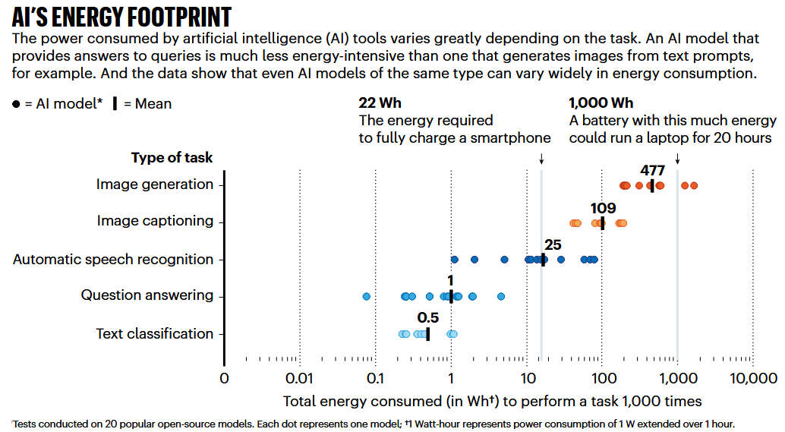{fig-align="center" .fragment data-fragment-index="4"}
:::
::::

## Quel gain de temps avec les LLMs ? {.smaller}

L'argument principal en faveur de l'IA est une accélération radicale du processus de recherche. Le schéma ci-contre montre comment l'IA s'intègre dans les étapes les plus chronophages d'une revue systématique.

::::: columns
::: {.column width="50%"}

::: incremental 
-   **Filtrage accéléré** : un outil comme **ASReview** a permis de réduire de **77 %** le temps de sélection (*screening*) des résumés dans une revue systématique [@vanDijk2023].
-   **Synthèse en temps record** : dans des études contrôlées, des agents IA interactifs (**InsightAgent**) ont permis à des cliniciens de réaliser une revue systématique complète en **environ 1h30** [@Qiu2025].
-   **De plusieurs jour à quelques minutes** : le filtrage de plus de 8 300 articles a été réalisé en **moins de 10 minutes** par une architecture multi-LLM [@Joos2025].

:::

::: {.callout-tip title="Le rôle de l'IA" .fragment}
L’IA est un **accélérateur de recherche** qui automatise les tâches répétitives, mais ne remplace pas le jugement humain pour la planification et l'analyse critique.
:::
:::

::: {.column width="50%" .fragment}
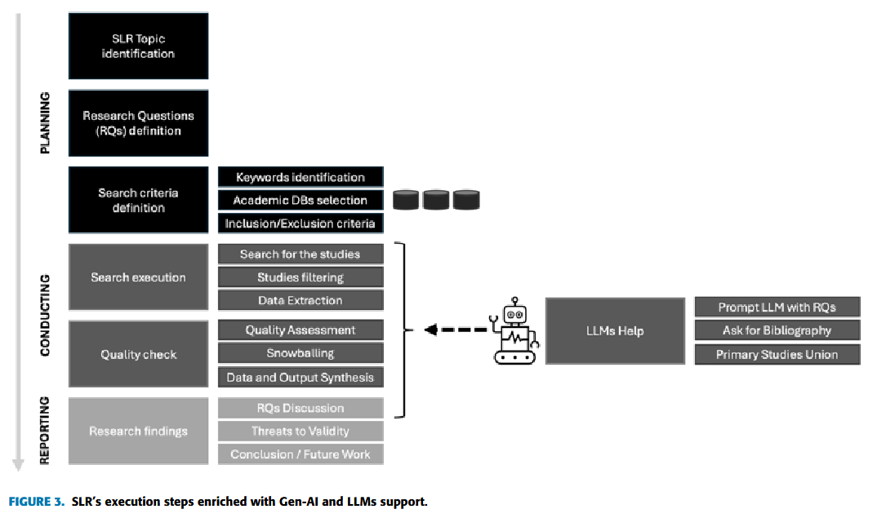{fig-align="center" width="100%"}
:::
:::::

------------------------------------------------------------------------

## Le match : précision contre complétude (rappel) {style="font-size:0.7em"}

Pour évaluer un outil de recherche, deux métriques sont essentielles.

::::: columns
::: {.column width="50%" .fragment}
### **Le Rappel (Recall / Sensibilité)**

*La capacité à trouver **tous** les documents pertinents.*

-   **Question** : ai-je raté des articles importants ?
-   **Objectif** : être exhaustif. 100 % = aucun article pertinent
    manqué.
-   **Risque** : un faible rappel mène à des conclusions biaisées.
:::

::: {.column width="50%" .fragment}
### **La Précision (Precision)**

*La capacité à ne retourner **que** des documents pertinents.*

-   **Question** : combien de "bruit" dois-je trier ?
-   **Objectif** : être pertinent. 100 % = tous les résultats sont
    utiles.
-   **Risque** : une faible précision fait perdre du temps.
:::
:::::

::: {.callout-alert title="Le Compromis" .fragment}
Un outil très exhaustif (**haut rappel**) ramène souvent beaucoup de
bruit (**basse précision**). Un outil très ciblé (**haute précision**)
peut omettre des références importantes (**bas rappel**).
:::

::: {.callout-note title="Évidence empirique" .fragment}
Comparativement aux IA testées (**Elicit, SciSpace**), **WoS/Scopus** obtiennent de meilleurs taux de **précision/qualité**, l’IA ramenant plus de références **uniques** mais souvent **moins bien classées** [@Tomczy2024].
:::

------------------------------------------------------------------------

## Un bilan nuancé quant aux performances {style="font-size:0.7em"}

Les performances des IA varient énormément selon les outils et les
méthodes.

::::: columns
::: {.column width="50%" .fragment}
#### des performances parfois excellentes...

-   **Consensus multi-LLM** : en faisant voter plusieurs modèles d'IA,
    une étude a atteint un **rappel de 98,8 %**, un taux d'erreur
    inférieur à celui d'un humain [@Joos2025].
-   **Systèmes interactifs supervisés** : avec l'aide d'un expert, un
    outil peut atteindre **98,5 % de rappel** [@Qiu2025].
:::

::: {.column width="50%" .fragment}
#### ...mais des échecs critiques et des biais tenaces.

-   **Elicit** n'a atteint en moyenne qu'un **rappel de 39,5 %** sur
    quatre études de cas, le rendant insuffisant pour une revue
    systématique exhaustive [@LauGolder2025].
-   Dans une autre étude, un outil IA a **totalement manqué les 32
    études primaires** d'une revue, à cause d'un fort biais de
    popularité [@Tosi2025].
:::
:::::

::: {.callout-alert title="Le compromis fondamental" .fragment}
L’IA peut **précisément** omettre l'essentiel. Sans supervision humaine
et validation croisée, le gain de temps peut se payer par une perte de
pertinence et d'exhaustivité.
:::

------------------------------------------------------------------------

## Conclusion

L'IA ne remplace pas le chercheur, elle transforme son rôle.

::: incremental

-   l’IA est un **levier de productivité** majeur, mais non dénué de
    risques importants.
-   la **vigilance critique** (biais, hallucinations, hacking) et la
    **vérification humaine** sont incontournables.
-   choisir **le bon outil pour la bonne tâche** est essentiel
    (exploration vs. synthèse vs. filtrage).
-   l'avenir est à la **collaboration homme-machine**, où l'expertise
    humaine guide la puissance de l'IA.
    
:::

## Références
